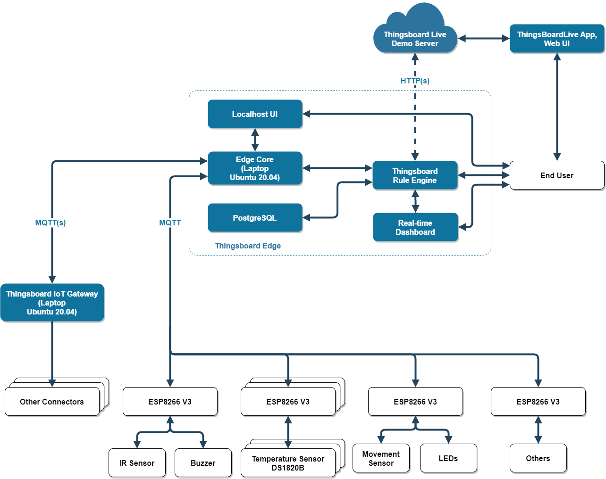

<!-- PROJECT LOGO -->
<br />
<div align="center">
  <a href="https://github.com/hungdaqq/Smarthome-IoT">
    
  </a>

<h3 align="center">Smart Home IoT</h3>

  <p align="center">
    My final project of IoT Network and Protocol course (semester 2022.1)
    <br />
    <a href="https://docs.google.com/document/d/1b8eUY19hVWinYOA9YIkjcR_toliwRPs9/edit?usp=sharing&ouid=113352961761938394358&rtpof=true&sd=true"><strong>Explore the docs »</strong></a>
    <br />
    <br />
    <a href="https://github.com/hungdaqq/Smarthome-IoT">View Demo</a>
    ·
    <a href="https://github.com/hungdaqq/Smarthome-IoT/issues">Report Bug</a>
    ·
    <a href="https://github.com/hungdaqq/Smarthome-IoT/issues">Request Feature</a>
  </p>
</div>


<!-- TABLE OF CONTENTS -->
<details>
  <summary>Table of Contents</summary>
  <ol>
    <li>
      <a href="#about-the-project">About The Project</a>
      </ul>
    </li>
    <li>
      <a href="#getting-started">Getting Started</a>
      <ul>
        <li><a href="#prerequisites">Prerequisites</a></li>
        <li><a href="#installation">Installation</a></li>
      </ul>
    </li>
    <li><a href="#usage">Usage</a></li>
    <li><a href="#roadmap">Roadmap</a></li>
    <li><a href="#contributing">Contributing</a></li>
    <li><a href="#license">License</a></li>
    <li><a href="#contact">Contact</a></li>
    <li><a href="#acknowledgments">Acknowledgments</a></li>
  </ol>
</details>


<!-- ABOUT THE PROJECT -->
## About The Project

<p align="justify">
This project is aimed at creating a smart home system that can control various devices in a house using internet connectivity. The system will allow the user to remotely control the lights, temperature, and appliances in their home, and receive real-time updates about their status. Below are the project requirements: </p>

- About networking protocols: MQTT or CoAP for the devices to the Gateway/Edge and HTTP for the Gateway/Edge to the Cloud server.
- Device communication: WiFi.
- Sensor devices must be operated in power-saving mode.
- User interface: Mobile application or browser.
- Intranet control and Internet-based control.

Project structure:
- `ESP8266` is a brief explanation of how to use Platform.io to create a microcontroller programming environment.
- `Thingsboard` contains template files for the Thingsboard Server configuration.
- `Features` is where we demonstrate the features and capabilities of this Smart Home, as well as how to implement them using the provided code, hardware schema, and controller interface.
<!-- GETTING STARTED -->
## Getting Started
<br />
<div align="center">
  <a href="https://github.com/hungdaqq/Smarthome-IoT">
    
  </a>
</div>
<p align="justify">
The project's deployment diagram is shown here. For WiFi communication between the system, we selected the low-cost MCU ESP8266, and chose the Thingsboard IoT Platform to monitor and control various types of endpoints via MQTT protocol. For edge computing, we used Thingsboard Edge, and for cloud computing, the Live Demo Server. Since it is an opensource platform, there is absolutely no expense involved. </p>

### Prerequisites
Before getting started with the project, you will need the following:
| Hardware | Software |
|----------|----------|
|A Raspberry Pi 3 or PC or any other IoT device that runs on Linux.|Raspbian Buster installed on your Raspberry Pi 3 or Debian (Ubuntu) installed on your PC.|
|NodeMCU ESP8266 for WiFi communication and devices you want to control (lights, temperature sensors, etc.).|Basic understanding of programming micro controller in C/C++, IoT network protocols and devices wiring.|
|A router to create a wireless local area network, with an internet connection to connect your Raspberry Pi to the internet.|An internet browser and mobile application to access the user interface of the smart home system.

### Installation

1. Clone the repo:
   ```sh
   git clone https://github.com/hungdaqq/Smarthome-IoT.git
   ```
2. Create a Thingsboard account at https://demo.thingsboard.io/ and login to use Thingsboard Live Demo server. Then go to [Thingsboard](https://github.com/hungdaqq/Smarthome-IoT/tree/main/Thingsboard) for a quick overview of this open-source IoT platform.
3. Follow the instructions to install [Thingsboard Edge CE](https://thingsboard.io/docs/user-guide/install/edge/installation-options/) v3.4.3 and provision your Edge to the Server.
4. Get and install the ThingsBoardLive on [App Store](https://apps.apple.com/us/app/thingsboard-live/id1594355695) or [Google Play](https://play.google.com/store/apps/details?id=org.thingsboard.demo.app&hl=vi&gl=US).
5. Please refer to [ESP8266](https://github.com/hungdaqq/Smarthome-IoT/tree/main/ESP8266) for setting up micro controllers programming evironment and [Features](https://github.com/hungdaqq/Smarthome-IoT/tree/main/Features) for ThingsBoard configuration as well as connecting the electronics components in accordance with the hardware schema.
6. (Optional) Follow the instructions to install [Thingsboard IoT Gateway](https://thingsboard.io/docs/iot-gateway/installation/) v2.9 on your Raspberry Pi or PC if you want integrate devices that are connected to legacy and third-party systems with ThingsBoard IoT platform. For example: external MQTT brokers, OPC-UA servers, Sigfox Backend, Modbus slaves or CAN nodes.

<!-- USAGE EXAMPLES -->
## Usage

1. Start Edge service by running the script:
   ```sh
   sudo service tb-edge start
   ```
2. Access the user interface by opening a web browser and navigating to https://demo.thingsboard.io/home or using ThingsBoardLive mobile application.
3. Use the interface to control the devices and other features in your home.


<!-- ROADMAP -->
## Roadmap and Future work

- [x] Indoor temperature monitoring
- [x] Outdoor temperature, humidity monitoring (with OpenWeather API)
- [x] Light and Household applicances control
- [x] Create alarms, send emails and notifications.
- [ ] Power consumption and charging monitoring
- [ ] Devices claming (QR code)
- [ ] Data analytics with Trendz

See the [open issues](https://github.com/hungdaqq/Smarthome-IoT/issues) for a full list of proposed features (and known issues).

<!-- CONTRIBUTING -->
## Contributing

Contributions to this project are welcome! If you have any ideas or suggestions, please feel free to open an issue or submit a pull request.

<!-- LICENSE -->
## License

Distributed under the MIT License. See `LICENSE.txt` for more information.


<!-- CONTACT -->
## Contact

Quang Hung Dang - [@hungdaqq](https://www.linkedin.com/in/hungdaqq/) - hungdaqq@gmail.com

Project Link: [https://github.com/hungdaqq/Smarthome-IoT/](https://github.com/hungdaqq/Smarthome-IoT/)


<!-- ACKNOWLEDGMENTS -->
## Acknowledgments
<p align="justify">
This project would not have been possible without the support and resources provided by the open-source community. We would like to extend our gratitude to all the developers and organizations who have contributed to the development of the libraries and tools used in this project.
</p>
