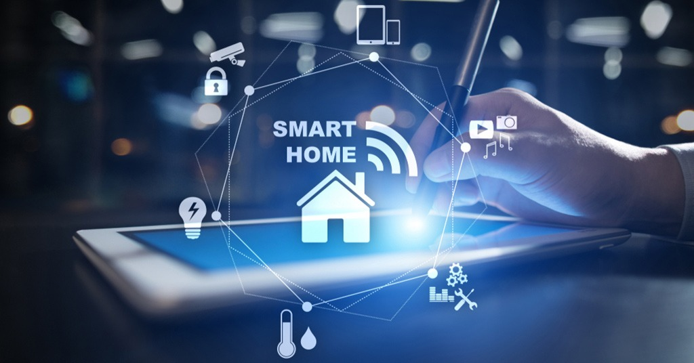

<!-- PROJECT LOGO -->
<br />
<div align="center">
  <a href="https://github.com/hungdaqq/Smarthome-IoT">
    
  </a>

<h3 align="center">Smart Home IoT</h3>

  <p align="center">
    My final project of IoT Network and Protocol course (semester 2022.1)
    <br />
    <a href="https://github.com/hungdaqq/Smarthome-IoT"><strong>Explore the docs »</strong></a>
    <br />
    <br />
    <a href="https://github.com/hungdaqq/Smarthome-IoT">View Demo</a>
    ·
    <a href="https://github.com/hungdaqq/Smarthome-IoT/issues">Report Bug</a>
    ·
    <a href="https://github.com/hungdaqq/Smarthome-IoT/issues">Request Feature</a>
  </p>
</div>


<!-- TABLE OF CONTENTS -->
<details>
  <summary>Table of Contents</summary>
  <ol>
    <li>
      <a href="#about-the-project">About The Project</a>
      </ul>
    </li>
    <li>
      <a href="#getting-started">Getting Started</a>
      <ul>
        <li><a href="#prerequisites">Prerequisites</a></li>
        <li><a href="#installation">Installation</a></li>
      </ul>
    </li>
    <li><a href="#usage">Usage</a></li>
    <li><a href="#roadmap">Roadmap</a></li>
    <li><a href="#contributing">Contributing</a></li>
    <li><a href="#license">License</a></li>
    <li><a href="#contact">Contact</a></li>
    <li><a href="#acknowledgments">Acknowledgments</a></li>
  </ol>
</details>


<!-- ABOUT THE PROJECT -->
## About The Project

<p align="justify">
This project is aimed at creating a smart home system that can control various devices in a house using internet connectivity. The system will allow the user to remotely control the lights, temperature, and appliances in their home, and receive real-time updates about their status. Below are the project 
</p>

- About protocols: MQTT or CoAP for the devices to the Gateway/Edge and HTTP for the Gateway/Edge to the Cloud server.
- Sensor devices must be operated in power-saving mode.
- Mobile application or browser for the user interface.
- Internal control and Internet-based control.

<!-- GETTING STARTED -->
## Getting Started
<br />
<div align="center">
  <a href="https://github.com/hungdaqq/Smarthome-IoT">
    
  </a>
</div>

### Prerequisites
Before getting started with the project, you will need the following:
| Hardware | Software |
|----------|----------|
|A Raspberry Pi or PC or any other IoT device that runs on Linux.|Raspbian Buster installed on your Raspberry Pi or Debian (Ubuntu) installed on your PC.|
|NodeMCU ESP8266 for WiFi communication and devices you want to control (lights, temperature sensors, etc.).|Basic understanding of programming micro controller in C/C++ and IoT network protocols.|
|A router to create a wireless local area network, with an internet connection to connect your Raspberry Pi to the internet.|An internet browser and mobile application to access the user interface of the smart home system.

### Installation

1. Clone the repo:
   ```sh
   https://github.com/hungdaqq/Smarthome-IoT.git
   ```
2. Create a Thingsboard account at https://demo.thingsboard.io/ and login to use Thingsboard Live Demo server.
3. Follow the instructions to install [Thingsboard Edge CE](https://thingsboard.io/docs/user-guide/install/edge/installation-options/) and [Thingsboard IoT Gateway](https://thingsboard.io/docs/iot-gateway/installation/) on your Raspberry Pi or PC. 
4. Get and install the ThingsBoardLive on App Store or Google Play.
5. Please refer to [ESP8266](https://github.com/hungdaqq/Smarthome-IoT/tree/main/ESP8266) for setting up micro controllers programming evironment, [Thingsboard]() for ThingsBoard configuration and [Features]() for the smart home features.

<!-- USAGE EXAMPLES -->
## Usage

Use this space to show useful examples of how a project can be used. Additional screenshots, code examples and demos work well in this space. You may also link to more resources.

_For more examples, please refer to the [Documentation](https://example.com)_


<!-- ROADMAP -->
## Roadmap and Future work

- [x] Temperature monitoring (inside with sensors and outside with OpenWeather API)
- [ ] Air quality monitoring (inside with sensors and outside with OpenWeather API)
- [x] Light and Household applicances control
- [x] Alarms and critical alerts
- [ ] Power consumption and charging monitoring
- [ ] Devices claming (QR code)

See the [open issues](https://github.com/hungdaqq/Smarthome-IoT/issues) for a full list of proposed features (and known issues).

<!-- CONTRIBUTING -->
## Contributing

Contributions to this project are welcome! If you have any ideas or suggestions, please feel free to open an issue or submit a pull request.

<!-- LICENSE -->
## License

Distributed under the MIT License. See `LICENSE.txt` for more information.


<!-- CONTACT -->
## Contact

Quang Hung Dang - [@hungdaqq](https://www.linkedin.com/in/hungdaqq/) - hungdaqq@gmail.com

Project Link: [https://github.com/hungdaqq/Smarthome-IoT/](https://github.com/hungdaqq/Smarthome-IoT/)


<!-- ACKNOWLEDGMENTS -->
## Acknowledgments

* []()
* []()
* []()
